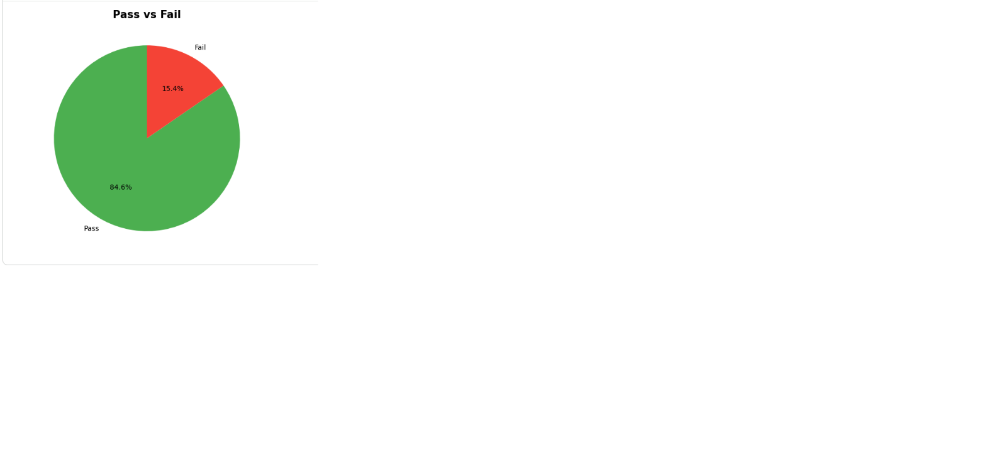
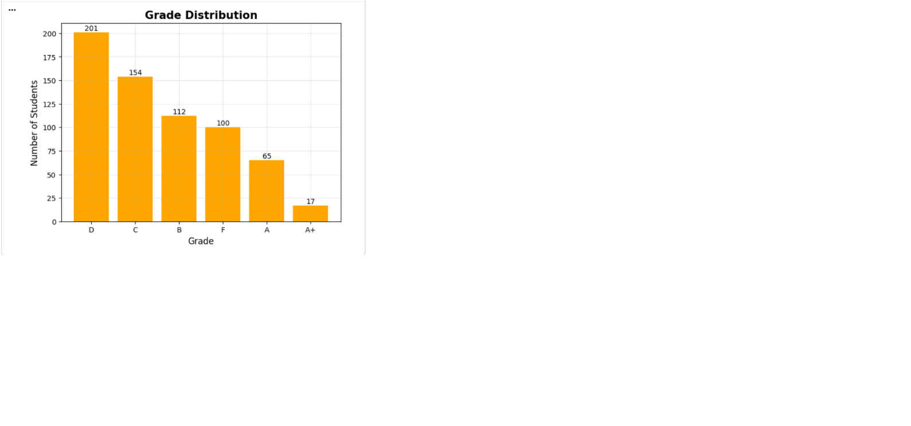
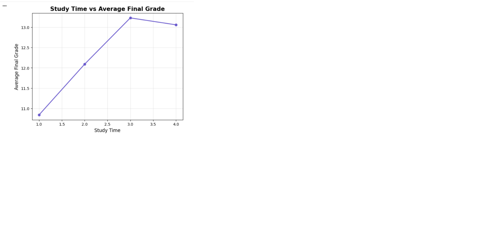
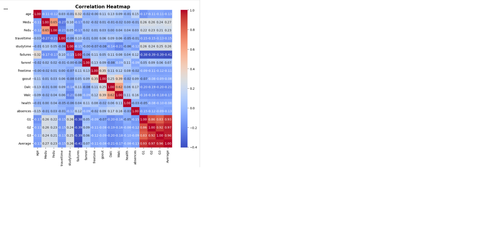
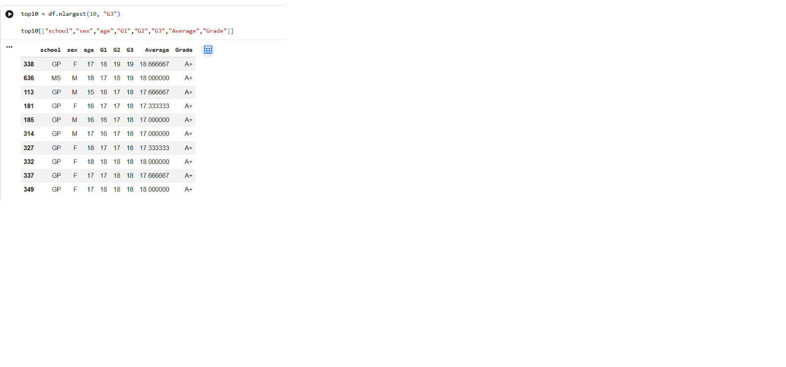

<h2>📈 Average Final Grade by Gender</h2>

  

<h2>🥧 Pass vs Fail</h2>

  

<h2>📊 Grade Distribution</h2>

  

<h2>📚 Study Time vs Final Grade</h2>

  

<h2>🔥 Correlation Heatmap</h2>

  

<h2>🏆 Top 10 Students</h2>

  

